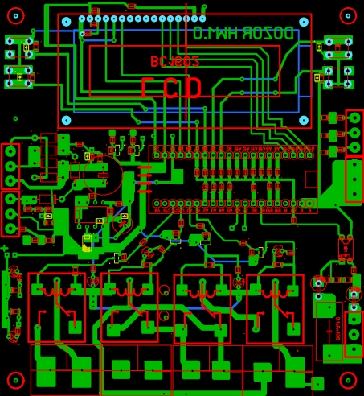
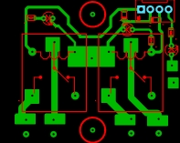
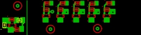
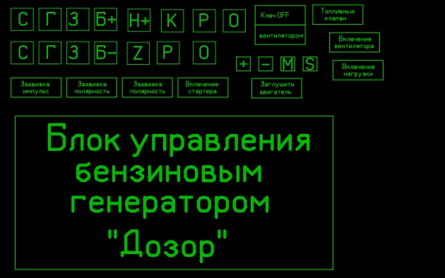

<h2 align="center">Печатные платы</h2>

Устройство собрано на печатных платах, изготовленных методом ЛУТ (лазерно-утюжная технология). Для печати шаблонов использована термотрансферная бумага. Дефекты при переводе рисунков подправлены лаком.

Все платы изготовлены из текстолита толщиной 1,5мм.

Основная плата изготовлена из двухстороннего текстолита.

В процессе доработки устройства пришлось сделать две дополнительные платы на которых установлены ключи управляющие реле, и плата повторителя датчика напряжения городской сети. 

На рисунках показаны шаблоны плат. Файлы находятся в папке Boards.

Основная плата (115 x 125 мм) 

Плата управления реле (50 x 40 мм) 

Плата ключей (60 x 15 мм) 

Бирки для реле и кнопок 

