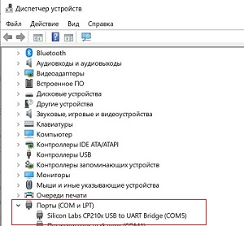
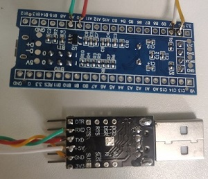
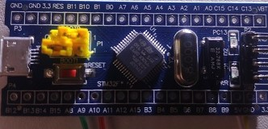
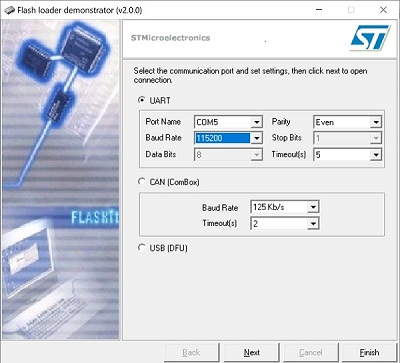
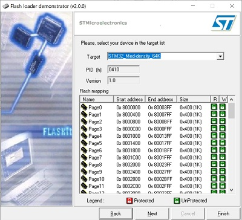
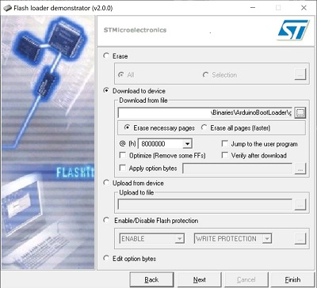
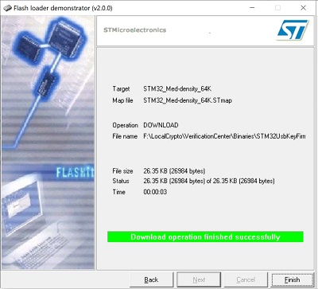

<h2 align="center">Прошивка отладочной платы.</h2>

Для прошивки потребуется преобразователь USB-UART. Подойдет любой. На рисунке плата преобразователя на основе чипа CP2102. Необходимо установить драйвера на вашу модель, и проверить определяется ли устройство. 

Далее припаиваем провода от преобразователя к отладочной плате. Потребуется 4 провода. 
Преобразователь TX - отладочная плата A10 
Преобразователь RX - отладочная плата A9 
Питание «плюс» и «минус». 
Стоит иметь ввиду – если неправильно согласованы уровни сигналов (вместо 3.3в приходит сигнал в 5 вольт) – плата может выйти из строя. К этому может привести и короткое замыкание сигнальных проводников. Обязательно проверяйте качество пайки. 

Установкой перемычек, «включаем» работу загрузчика микроконтроллера. 

Для загрузки прошивки необходимо скачать (или взять в .\Binaries\FlashLoader.zip) программу Flash Loader Demonstrator. 
Запускаем программу. Устанавливаем порт, на котором определился переходник. 
 
Выбираем семейство 
 
 
Для данного проекта используем загрузчик Arduino.
Для прошивки загрузчика необходимо изменить тип файлов на *.bin 
 
Прошиваем. 
 
Возвращаем перемычки в исходное положение.

<a href="../HowLoadFirmware.md">После прошивки загрузчика, необходимо настроить среду разработки.</a>

